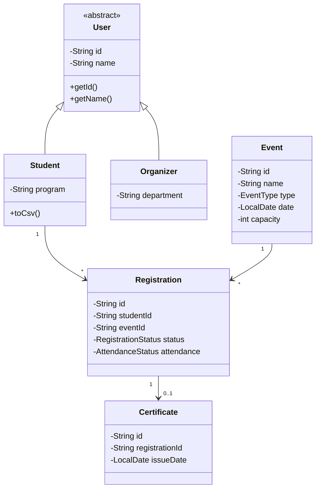

# Class Diagram

```mermaid
classDiagram
    class User {
      <<abstract>>
      -String id
      -String name
      +getId()
      +getName()
    }
    class Student {
      -String program
      +toCsv()
    }
    class Organizer {
      -String department
    }
    class Event {
      -String id
      -String name
      -EventType type
      -LocalDate date
      -int capacity
    }
    class Registration {
      -String id
      -String studentId
      -String eventId
      -RegistrationStatus status
      -AttendanceStatus attendance
    }
    class Certificate {
      -String id
      -String registrationId
      -LocalDate issueDate
    }
    User <|-- Student
    User <|-- Organizer
    Student "1" --> "*" Registration
    Event "1" --> "*" Registration
    Registration "1" --> "0..1" Certificate
```
