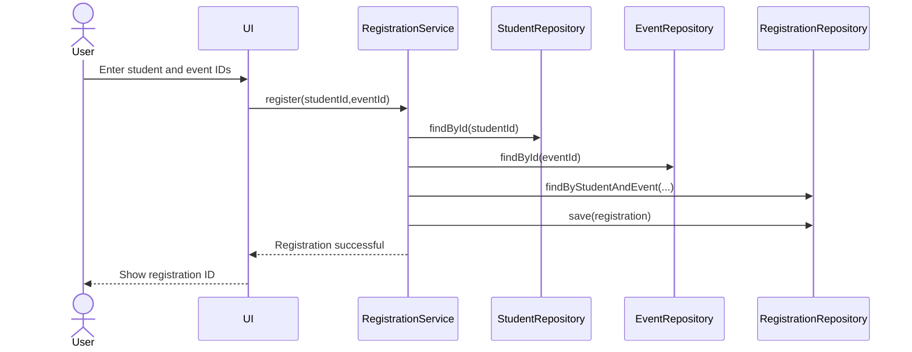

# Sequence Diagram

```mermaid
sequenceDiagram
    actor User
    participant UI
    participant RegistrationService
    participant StudentRepository
    participant EventRepository
    participant RegistrationRepository
    User->>UI: Enter student and event IDs
    UI->>RegistrationService: register(studentId,eventId)
    RegistrationService->>StudentRepository: findById(studentId)
    RegistrationService->>EventRepository: findById(eventId)
    RegistrationService->>RegistrationRepository: findByStudentAndEvent(...)
    RegistrationService->>RegistrationRepository: save(registration)
    RegistrationService-->>UI: Registration successful
    UI-->>User: Show registration ID
```
