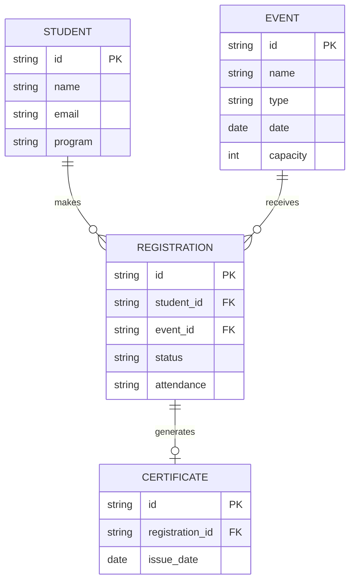

# Storage Design

```mermaid
erDiagram
    STUDENT ||--o{ REGISTRATION : makes
    EVENT ||--o{ REGISTRATION : receives
    REGISTRATION ||--o| CERTIFICATE : generates

    STUDENT {
      string id PK
      string name
      string email
      string program
    }
    EVENT {
      string id PK
      string name
      string type
      date date
      int capacity
    }
    REGISTRATION {
      string id PK
      string student_id FK
      string event_id FK
      string status
      string attendance
    }
    CERTIFICATE {
      string id PK
      string registration_id FK
      date issue_date
    }
```
