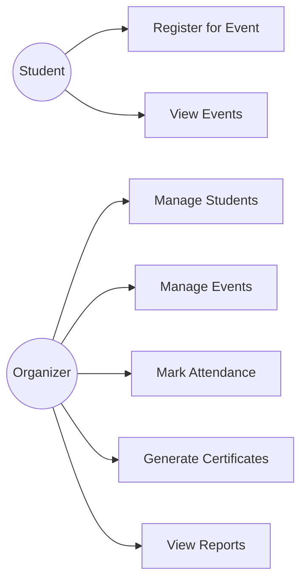

# Use Case Diagram

```mermaid
flowchart LR
    Student((Student)) --> R[Register for Event]
    Student --> V[View Events]
    Organizer((Organizer)) --> SM[Manage Students]
    Organizer --> EM[Manage Events]
    Organizer --> AM[Mark Attendance]
    Organizer --> CM[Generate Certificates]
    Organizer --> RP[View Reports]
```
