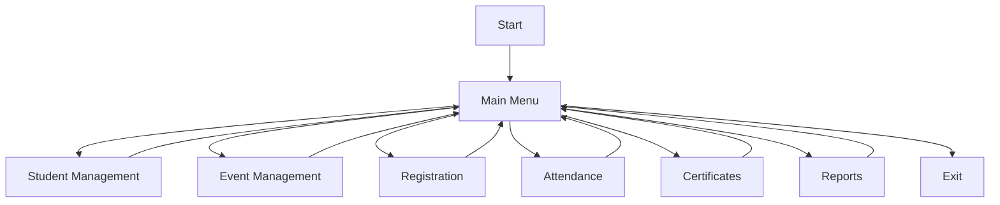

# Workflow

```mermaid
flowchart TD
    A[Start] --> B[Main Menu]
    B --> C[Student Management]
    B --> D[Event Management]
    B --> E[Registration]
    B --> F[Attendance]
    B --> G[Certificates]
    B --> H[Reports]
    C --> B
    D --> B
    E --> B
    F --> B
    G --> B
    H --> B
    B --> I[Exit]
```
